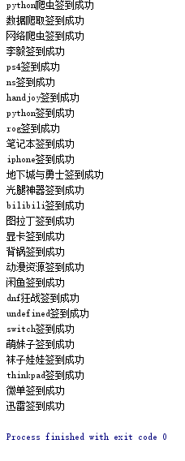

[](https://www.python.org/downloads/)


- 该项目会长期更新。
- 欢迎提issue，维护者看到后都会积极回答。

## 快速开始 :octocat:

1.概述
   
`
    由于百度贴吧官方提供的一键签到目前仅支持7级以上吧。构建灌水小工具对于一些新关注的贴吧
`
   
2.使用

- 运行 main.py  
 

```
使用百度贴吧手机客户端扫描  授权登录 弹出的贴吧登录二维码(15秒内)
（程序固定二维码停留有效时间15秒）
（成功授权登录后仍需固定等待有效期结束） 

- fixing
```

2.签到

```
登录成功后，会读取该账号所有关注贴吧  进行自动签到
```


3.效果图



## 重要声明 :loudspeaker:
该项目开发的初衷是为了学术研究。


